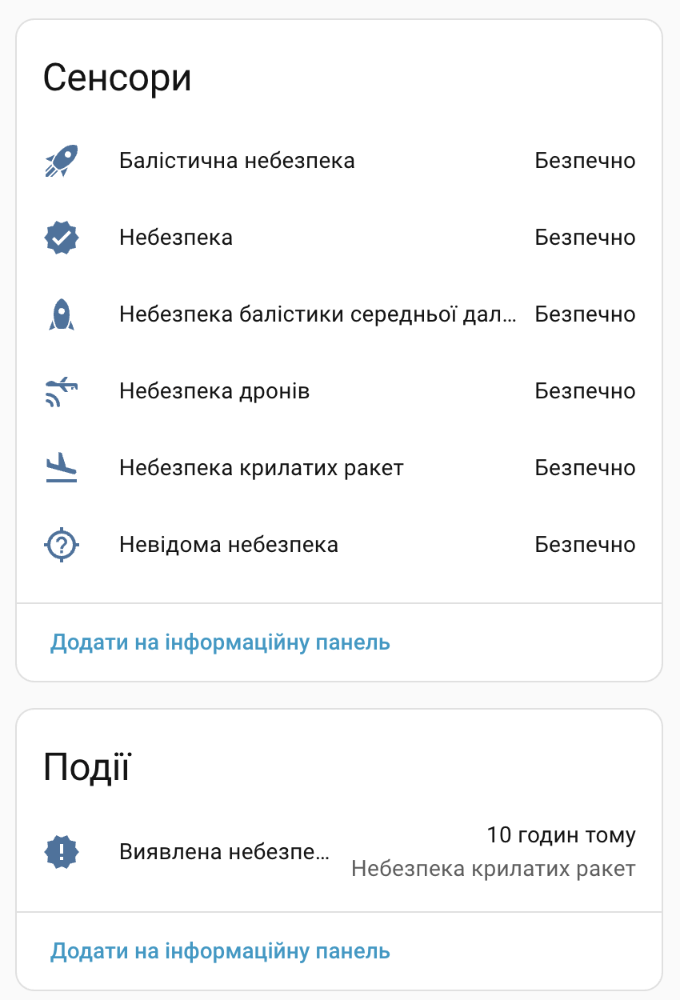
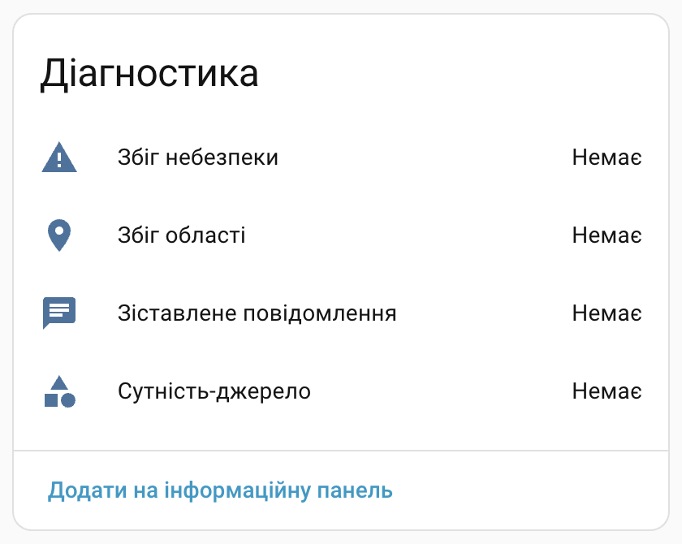

[](https://stand-with-ukraine.pp.ua/)

<!-- markdownlint-disable no-inline-html -->
<h1 align="center">
  
  <br />
  💥 HA Aerial Danger
</h1>
<!-- markdownlint-enable no-inline-html -->

[![GitHub Release][gh-release-image]][gh-release-url]
[![GitHub Downloads][gh-downloads-image]][gh-downloads-url]
[![hacs][hacs-image]][hacs-url]
[![GitHub Sponsors][gh-sponsors-image]][gh-sponsors-url]
[![Buy Me A Coffee][buymeacoffee-image]][buymeacoffee-url]
[![Twitter][twitter-image]][twitter-url]

[Українською](./readme.md) | [**English**](./readme.en.md)

> [!NOTE]
> A [Home Assistant][home-assistant] integration for detecting aerial danger affecting configured Ukrainian regions and localities.

## About the integration

**Aerial Danger** analyzes aerial-threat messages and determines whether they affect selected regions or localities.

It detects IRBM[^1], MLRS[^2], GAB[^3], ballistic missile, cruise missile, drone, and unclassified aerial threats.

Aerial Danger does not fetch messages itself. The integration analyzes the text state of selected Home Assistant entities. For example, you can create these entities from public Telegram channels with the [Scrape][scrape-url] integration.

> [!CAUTION]
> **The integration can make mistakes, miss messages, or detect them late.**
>
> Do not use it as your only or official source of alerts.
>
> Always follow official alerts and instructions. During an air raid alert, immediately go to the nearest shelter and remain there until the official all-clear.
>
> The integration is provided “as is.” The author does not guarantee the accuracy, completeness, or timeliness of the data and is not responsible for user safety, decisions, or consequences arising from use of the integration.

## Support the project

Your support helps develop this and other Ukrainian Home Assistant projects.

- 💖 [GitHub Sponsors][gh-sponsors-url]
- ☕️ [Buy Me A Coffee][buymeacoffee-url]
- Bitcoin: `bc1q7lfx6de8jrqt8mcds974l6nrsguhd6u30c6sg8`
- Ethereum: `0x6aF39C917359897ae6969Ad682C14110afe1a0a1`

## Installation

The easiest way to install the integration is through [HACS][hacs-url]:

[![Add to HACS with My Home Assistant][hacs-install-image]][hacs-install-url]

<details>
  <summary>If the button does not work, add the repository manually</summary>

1. Open **HACS → Integrations**.
2. Open **⋮ → Custom repositories**.
3. Enter `https://github.com/denysdovhan/ha-aerial-danger`.
4. Select **Integration** as the category and select **Add**.
5. Find **Aerial Danger**, install the integration, and restart Home Assistant.

</details>

## Set up message sources

Aerial Danger requires at least one message source whose current state contains the text of a threat message.

The integration supports entities in the `sensor`, `text`, and `input_text` domains. It analyzes only the entity state, so the state must contain the message text itself.

> [!WARNING]
> You choose the message sources. The integration does not verify the accuracy or completeness of the data and does not guarantee timely alerts.

You can use public monitoring Telegram channels as message sources, for example:

| Channel                                                           | URL                                 |
| ----------------------------------------------------------------- | ----------------------------------- |
| [Ukrainian Air Force](https://telegram.me/s/kpszsu)               | `https://telegram.me/s/kpszsu`      |
| [War Monitor](https://telegram.me/s/war_monitor)                  | `https://telegram.me/s/war_monitor` |
| [Aeris Rimor](https://telegram.me/s/AerisRimor)                   | `https://telegram.me/s/AerisRimor`  |
| [Operatyvnyi Inform](https://telegram.me/s/operinform)            | `https://telegram.me/s/operinform`  |
| [Kyiv Air Defence](https://telegram.me/s/kyiv_airdef) (Kyiv only) | `https://telegram.me/s/kyiv_airdef` |

You can read messages from Telegram channels with the [Scrape][scrape-url] integration.

### Create a Scrape sensor for a Telegram channel

Create a separate [Scrape][scrape-url] integration entry for every channel you need:

[![Add the Scrape integration][scrape-install-image]][scrape-install-url]

<details>
  <summary>If the button does not work, configure the entry manually</summary>

1. Open **Settings → Devices & services → Add integration**.
2. Select **Scrape**.
3. Enter the channel URL in the format `https://telegram.me/s/CHANNEL`.

</details>

For the Ukrainian Air Force channel, use these main settings:

| Setting  | Value                          |
| -------- | ------------------------------ |
| Resource | `https://telegram.me/s/kpszsu` |
| Method   | `GET`                          |

On the next step, add a sensor:

| Setting                            | Value                                                    |
| ---------------------------------- | -------------------------------------------------------- |
| Name                               | `Ukrainian Air Force Telegram`                           |
| CSS selector                       | `.js-widget_message_wrap:last-child .js-message_text`    |
| Advanced settings → Value template | `{{ value \| trim \| truncate(255, end='', leeway=0) }}` |

The template removes extra whitespace and limits the sensor state to 255 characters, the maximum length of a Home Assistant entity state.

Repeat these steps for every channel you need.

### Update the created sensors more frequently

By default, Scrape polls the resource every 600 seconds (10 minutes). This interval may be too long for aerial-threat alerts.

Import the ready-made automation blueprint, then select the created Scrape sensors and a refresh interval of 5 or 10 seconds:

[![Import the automation for Telegram sensors][blueprint-install-image]][telegram-scrape-blueprint-install-url]

<details>
  <summary>If the button does not work, create the automation manually</summary>

```yaml
alias: Update Telegram sensors every 5 seconds
description: Force-updates message sources for Aerial Danger
triggers:
  - trigger: time_pattern
    seconds: "/5"
conditions: []
actions:
  - action: homeassistant.update_entity
    target:
      entity_id:
        - sensor.telegram_kpszsu
mode: single
max_exceeded: silent
```

> [!IMPORTANT]
> Replace `sensor.telegram_kpszsu` with your sensor's actual entity ID. For multiple channels, add all entities to the `entity_id` list.

> [!TIP]
> To reduce the number of requests, update sensors only during an active air raid alert. In the blueprint, select the **Air raid alert** safety sensors from the [Ukraine Alarm][ukraine-alarm-url] integration. If you create the automation manually, add the corresponding check to the `conditions` block.

</details>

## Configure Aerial Danger

Add an **Aerial Danger** integration entry:

[![Configure Aerial Danger][aerial-danger-install-image]][aerial-danger-install-url]

<details>
  <summary>If the button does not work, configure the integration manually</summary>

1. Open **Settings → Devices & services → Add integration**.
2. Find and select **Aerial Danger**.

</details>

1. Set the entry name. Your home name is used by default.
2. Select one or more threat-message sources.
3. Select preset regions and localities or add custom regular expressions.

### Configure regions and localities

**Regions** are used to detect ballistic missiles, cruise missiles, and other fast-moving threats.

**Localities** are required to detect MLRS[^2], GAB[^3], and drones. They are also used for all other threat types.

You can combine preset regions and localities with custom [Python regular expressions][python-regex-url] in a YAML list:

```yaml
- (до|на) нас
- наш(у|ої) област(ь|і)?
```

> [!IMPORTANT]
> Select at least one message source and at least one region or locality.

> [!TIP]
> We recommend selecting your locality and neighboring localities to receive messages about approaching threats.

Create multiple independent integration entries if different areas require different sources or detection rules.

## Created entities

Each integration entry creates these entities:

| Danger sensors                | Diagnostic sensors                 |
| ----------------------------- | ---------------------------------- |
|  |  |

How these entities work:

| Type               | Entities                                                                           | Purpose                                             |
| ------------------ | ---------------------------------------------------------------------------------- | --------------------------------------------------- |
| Danger sensors     | IRBM[^1], MLRS[^2], GAB[^3], ballistic, cruise missile, drone, unclassified danger | Show an active threat of the corresponding type     |
| Aggregate sensor   | **Danger**                                                                         | Remains on while at least one threat type is active |
| Diagnostic sensors | Detected message, area, threat type, and message source                            | Show data from the latest active detection          |
| Event entity       | **Danger detected**                                                                | Records every new detection for automations         |

All binary sensors have stable attributes:

| Attribute          | Value                                                      |
| ------------------ | ---------------------------------------------------------- |
| `matched_message`  | Full text of the message in which the threat was detected  |
| `matched_area`     | Part of the message matching a selected region or locality |
| `matched_danger`   | Part of the message indicating the threat type             |
| `source_entity_id` | ID of the entity from which the message was received       |

For an IRBM[^1] threat, the area sensor shows **Nationwide** because these messages are treated as nationwide alerts.

## Automations and notifications

The integration's primary purpose is to start automations and send critical notifications after detecting a threat.

### Critical notifications

Import the ready-made blueprint and use it to create a critical-notification automation:

[![Import the critical-notification blueprint][blueprint-install-image]][critical-notification-blueprint-install-url]

When creating the automation:

1. Select the **Aerial Danger** device.
2. Select a mobile device with the Home Assistant app.
3. Set the delay between repeated notifications.

The blueprint sends critical notifications on iOS and high-priority notifications on Android. The text includes the detected area and the full threat message.

### Built-in triggers

To create your own automation, add a trigger, select the **Aerial Danger** device, and then select the required detection type:

- **Any danger detected**
- **IRBM danger detected**
- **MLRS danger detected**
- **GAB danger detected**
- **Ballistic danger detected**
- **Cruise missile danger detected**
- **Drone danger detected**
- **Unclassified danger detected**

> [!IMPORTANT]
> Triggers fire for every matching detection, including repeated messages of the same type.

## How detection works

1. The integration reacts to text-state changes in every selected entity and does not poll external sources itself.
2. In each message, the integration searches for threat keywords and mentions of selected regions or localities.
3. The first detected threat type is stored for each source.
   1. IRBM[^1] does not require a locality or region mention.
   2. MLRS[^2], GAB[^3], and drones require a locality name.
   3. All other threat types require either a region or locality.
4. The state remains active until a new message without a threat arrives from the same source.
5. Sources are processed independently: a safe message clears only its own source state.
6. Every new detection, including a repeated message of the same type, updates the event entity and diagnostic sensors.

## Frequently asked questions

### Why does the integration not fetch messages itself?

Sources differ between regions and localities. You select the sources you need, and Aerial Danger only analyzes the text in their states.

### Why does the integration not use artificial intelligence for analysis?

AI models can miss a threat, react incorrectly to a safe message, or delay a result. Regular expressions and keywords are simpler, but they work predictably and almost instantly.

### How do I add a missing region or locality?

1. Create a [regular expression][python-regex-url] that accounts for different forms of the name. For example: `Kyiv`, `Kyiv's`, `in Kyiv`.
2. Test the expression in a [regular expression sandbox](https://regexr.com/).
3. Add the expression to the integration settings.
4. To share it with other users, add it to the [locality list][presets] and submit a [pull request][contributing].

## Troubleshooting

- **The source is empty or has the `unavailable` state.** Check the URL, CSS selector, and whether the public channel is available without authentication.
- **The threat is not detected.** Make sure the selected entity contains the message text and the message mentions the configured region or locality. IRBM does not require an area mention.
- **Channel updates make too many requests.** Select a 10-second interval in the blueprint, keep only the required channels, or limit updates to active alerts with Ukraine Alarm.
- **You need to change sources or areas.** Open **Settings → Devices & services → Aerial Danger → Configure**.

## Removal

To remove an Aerial Danger entry:

1. Open **Settings → Devices & services → Aerial Danger**.
2. Open the **⋮** menu next to the required entry and select **Delete**.

The integration entry and its entities are removed together. Remove Scrape sensors, automations, and the integration files in HACS separately if you no longer need them.

## Development

Want to help the project? Thank you! Read the [contribution guidelines][contributing].

## License

[MIT License](./license.md) © [Denys Dovhan][denysdovhan].

<!-- Footnotes -->

[^1]: IRBM — intermediate-range ballistic missile

[^2]: MLRS — multiple launch rocket system

[^3]: GAB — guided aerial bomb

<!-- Badges -->

[gh-release-url]: https://github.com/denysdovhan/ha-aerial-danger/releases/latest
[gh-release-image]: https://img.shields.io/github/v/release/denysdovhan/ha-aerial-danger?style=flat-square
[gh-downloads-url]: https://github.com/denysdovhan/ha-aerial-danger/releases
[gh-downloads-image]: https://img.shields.io/github/downloads/denysdovhan/ha-aerial-danger/total?style=flat-square
[hacs-url]: https://github.com/hacs/integration
[hacs-image]: https://img.shields.io/badge/hacs-custom-orange.svg?style=flat-square
[gh-sponsors-url]: https://github.com/sponsors/denysdovhan
[gh-sponsors-image]: https://img.shields.io/github/sponsors/denysdovhan?style=flat-square
[buymeacoffee-url]: https://buymeacoffee.com/denysdovhan
[buymeacoffee-image]: https://img.shields.io/badge/support-buymeacoffee-222222.svg?style=flat-square
[twitter-url]: https://x.com/denysdovhan
[twitter-image]: https://img.shields.io/badge/follow-%40denysdovhan-000000.svg?style=flat-square

<!-- References -->

[home-assistant]: https://www.home-assistant.io/
[denysdovhan]: https://github.com/denysdovhan
[hacs-install-url]: https://my.home-assistant.io/redirect/hacs_repository/?owner=denysdovhan&repository=ha-aerial-danger&category=integration
[hacs-install-image]: https://my.home-assistant.io/badges/hacs_repository.svg
[scrape-url]: https://www.home-assistant.io/integrations/scrape/
[scrape-install-url]: https://my.home-assistant.io/redirect/config_flow_start?domain=scrape
[scrape-install-image]: https://my.home-assistant.io/badges/config_flow_start.svg
[ukraine-alarm-url]: https://www.home-assistant.io/integrations/ukraine_alarm/
[aerial-danger-install-image]: https://my.home-assistant.io/badges/config_flow_start.svg
[aerial-danger-install-url]: https://my.home-assistant.io/redirect/config_flow_start/?domain=aerial_danger
[blueprint-install-image]: https://my.home-assistant.io/badges/blueprint_import.svg
[telegram-scrape-blueprint-install-url]: https://my.home-assistant.io/redirect/blueprint_import/?blueprint_url=https%3A%2F%2Fgithub.com%2Fdenysdovhan%2Fha-aerial-danger%2Fblob%2Fmain%2Fblueprints%2Ftelegram_scrape_refresh.yaml
[critical-notification-blueprint-install-url]: https://my.home-assistant.io/redirect/blueprint_import/?blueprint_url=https%3A%2F%2Fgithub.com%2Fdenysdovhan%2Fha-aerial-danger%2Fblob%2Fmain%2Fblueprints%2Faerial_danger_critical_notification.yaml
[python-regex-url]: https://docs.python.org/3/library/re.html
[contributing]: ./contributing.md
[presets]: https://github.com/denysdovhan/ha-aerial-danger/blob/main/custom_components/aerial_danger/danger/presets.py
