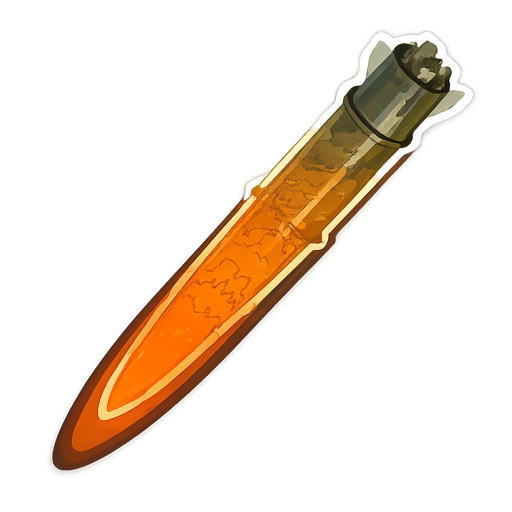

[](https://stand-with-ukraine.pp.ua/)

<!-- markdownlint-disable no-inline-html -->
<h1 align="center">
  
  <br />
  💥 HA Aerial Danger
</h1>
<!-- markdownlint-enable no-inline-html -->

[![GitHub Release][gh-release-image]][gh-release-url]
[![GitHub Downloads][gh-downloads-image]][gh-downloads-url]
[![hacs][hacs-image]][hacs-url]
[![GitHub Sponsors][gh-sponsors-image]][gh-sponsors-url]
[![Buy Me A Coffee][buymeacoffee-image]][buymeacoffee-url]
[![Twitter][twitter-image]][twitter-url]

> [!NOTE]
> A [Home Assistant][home-assistant] integration for detecting aerial danger affecting configured Ukrainian regions and localities.

**Aerial Danger** analyzes text from selected Home Assistant entities and exposes safety sensors, events, and automation triggers.

It recognizes: intermediate-range ballistic missiles, ballistic missiles, cruise missiles, drones, unknown/generic aerial threats.

This integrations has full English localization. Below is a Ukrainian setup guide, since Ukrainians suffering from attacks are the main target audience of this integration.

---

## Про інтеграцію

**Aerial Danger** аналізує повідомлення про повітряні загрози та визначає, чи стосуються вони вибраного регіону або місцевості.

Інтеграція не отримує повідомлення самостійно. Їй потрібні інші сутності Home Assistant, стан яких містить текст для аналізу. Наприклад, такі сутності можна створити за допомогою інтеграції [Scrape](https://www.home-assistant.io/integrations/scrape) для публічних Telegram-каналів.

> [!CAUTION]
> **Інтеграція може помилятися, пропускати повідомлення або виявляти їх із запізненням.**
>
> Не використовуйте її як єдине чи офіційне джерело сповіщень.
>
> Завжди стежте за офіційними сповіщеннями та виконуйте їхні вказівки. Під час повітряної тривоги негайно прямуйте до найближчого укриття та залишайтеся там до офіційного відбою.
>
> Інтеграція надається «як є». Автор не гарантує точність, повноту чи своєчасність даних і не несе відповідальності за безпеку користувачів, ухвалені рішення або наслідки використання інтеграції.

## Підтримати проєкт

Ваша підтримка допомагає розвивати цей та інші українські проєкти для Home Assistant.

- 💖 [GitHub Sponsors][gh-sponsors-url]
- ☕️ [Buy Me A Coffee][buymeacoffee-url]
- Bitcoin: `bc1q7lfx6de8jrqt8mcds974l6nrsguhd6u30c6sg8`
- Ethereum: `0x6aF39C917359897ae6969Ad682C14110afe1a0a1`

## Встановлення

Найпростіший спосіб встановити інтеграцію — через [HACS][hacs-url]:

[![Додати до HACS через My Home Assistant][hacs-install-image]][hacs-install-url]

<details>
  <summary>Якщо кнопка не працює, додайте репозиторій вручну</summary>

1. Відкрийте **HACS → Інтеграції**.
2. Відкрийте меню **⋮ → Користувацькі репозиторії**.
3. Вставте `https://github.com/denysdovhan/ha-aerial-danger`.
4. Виберіть категорію **Integration** і натисніть **Add**.
5. Знайдіть **Aerial Danger**, встановіть інтеграцію та перезапустіть Home Assistant.

</details>

## Налаштування джерел повідомлень

Для роботи Aerial Danger потрібне джерело повідомлень про загрози.

Джерелом можуть слугувати будь-які сутності Home Assistant, стан яких містить актуальний текст повідомлення, наприклад: `input_text`, `sensor`, `text`.

> [!WARNING]
> Користувачі самостійно обирають джерела повідомлень. Інтеграція не перевіряє достовірність або повноту даних і не гарантує своєчасність сповіщень.

В якості джерел повідомлень про загрози можна використовувати моніторингові Telegram-канали, наприклад:

| Канал                                                             | Адреса                              |
| ----------------------------------------------------------------- | ----------------------------------- |
| [Повітряні Сили ЗСУ](https://telegram.me/s/kpszsu)                | `https://telegram.me/s/kpszsu`      |
| [War Monitor](https://telegram.me/s/war_monitor)                  | `https://telegram.me/s/war_monitor` |
| [Aeris Rimor](https://telegram.me/s/AerisRimor)                   | `https://telegram.me/s/AerisRimor`  |
| [Оперативний інформ](https://telegram.me/s/operinform)            | `https://telegram.me/s/operinform`  |
| [Kyiv Air Defence](https://telegram.me/s/kyiv_airdef) (лише Київ) | `https://telegram.me/s/kyiv_airdef` |

Читати повідомлення з Telegram-каналів можна за допомогою інтеграції [Scrape][scrape-url].

### Створіть Scrape-сенсор для читання Telegram-каналів

Додайте запис інтеграції [Scrape][scrape-url] для кожного потрібного каналу. Натисніть на кнопку, щоб налаштувати запис:

[![Додати інтеграцію Scrape][scrape-install-image]][scrape-install-url]

<details>
  <summary>Якщо кнопка не працює, налаштуйте запис вручну</summary>

1. Відкрийте **Налаштування → Пристрої та служби → Додати інтеграцію** та виберіть **Scrape**.
2. Створіть ресурс із URL каналу у форматі `https://telegram.me/s/CHANNEL`.
3. У створеному записі Scrape додайте сенсор із параметрами нижче.

</details>

Заповніть параметри за прикладом (приклад для каналу Повітряних сил ЗСУ):

| Параметр | Значення                       |
| -------- | ------------------------------ |
| Ресурс   | `https://telegram.me/s/kpszsu` |
| Метод    | `GET`                          |

На наступному кроці додайте сенсор із параметрами нижче:

| Параметр                                 | Значення                                                 |
| ---------------------------------------- | -------------------------------------------------------- |
| Назва                                    | `Повітряні Сили ЗСУ Telegram`                            |
| CSS-селектор                             | `.js-widget_message_wrap:last-child .js-message_text`    |
| Додаткові налаштування → Шаблон значення | `{{ value \| trim \| truncate(255, end='', leeway=0) }}` |

Шаблон прибирає зайві пробіли та обмежує стан сенсора до 255 символів — максимальної довжини стану сутності Home Assistant.

Повторіть налаштування для кожного потрібного каналу.

### Оновлюйте дані створених сенсорів частіше

Scrape за замовчуванням опитує ресурс кожні 600 секунд (10 хвилин). В умовах повітряної тривоги цього недостатньо.

Імпортуйте готовий blueprint і створіть із нього автоматизацію:

[![Імпортувати blueprint для оновлення Telegram-сенсорів][blueprint-install-image]][telegram-scrape-blueprint-install-url]

Виберіть створені Scrape-сенсори, інтервал 5 або 10 секунд і, за потреби, сенсори Ukraine Alarm.

Або створіть автоматизацію вручну:

```yaml
alias: Оновлення Telegram-сенсорів кожні 5 секунд
description: Примусово оновлює джерела повідомлень для Aerial Danger
triggers:
  - trigger: time_pattern
    seconds: "/5"
conditions: []
actions:
  - action: homeassistant.update_entity
    target:
      entity_id:
        - sensor.telegram_kpszsu
mode: single
max_exceeded: silent
```

> [!IMPORTANT]
> Замініть `sensor.telegram_kpszsu` на фактичний ідентифікатор свого сенсора. Для кількох каналів додайте всі сутності до списку `entity_id`.

> [!TIP]
> Щоб зменшити інтенсивність опитування, можна примусово оновлювати сенсори лише під час активної повітряної тривоги. Для цього додайте умову перевірки стану офіційного сенсора [Ukraine Alarm][ukraine-alarm-url] у блоці `conditions` автоматизації.

## Налаштування Aerial Danger

Додайте запис інтеграції **Aerial Danger (Повітряна загроза)** натиснувши на кнопку:

[![Налаштувати Aerial Danger][aerial-danger-install-image]][aerial-danger-install-url]

<details>
  <summary>Якщо кнопка не працює, налаштуйте інтеграцію вручну</summary>

1. Відкрийте **Налаштування → Пристрої та служби → Додати інтеграцію**.
2. Знайдіть **Aerial Danger**.

</details>

Налаштуйте імʼя запису (за замовчування імʼя вашого дому) та вкажіть джерела повідомлень про загрози.

### Налаштування регіонів та місцевостей

**Регіони** використовуються для виявлення балістичних, крилатих та інших швидкісних загроз.

**Місцевості** використовуються для дронів і всіх інших типів загроз.

Готові пресети можна поєднувати з власними [Python-сумісними регулярними виразами][python-regex-url] у форматі списку YAML:

```yaml
- (до|на) нас
- наш(у|ої) област(ь|і)?
```

> [!IMPORTANT]
> Потрібно вибрати щонайменше одне джерело та додати щонайменше один регіон або одну місцевість.

> [!TIP]
> Рекомендуємо обрати свою та сусідні місцевості, щоб отримувати повідомлення про наближення цілей.

Для різних територій, провайдерів або груп каналів можна створити кілька незалежних записів інтеграції.

## Створені сутності

Кожен запис інтеграції створює такі сутності:

| Тип               | Сутності                                                              | Призначення                                      |
| ----------------- | --------------------------------------------------------------------- | ------------------------------------------------ |
| Сенсори небезпеки | БРСД[^1], балістика, крилаті ракети, дрони, невідома небезпека        | Показують активну загрозу відповідного типу      |
| Загальний сенсор  | **Небезпека**                                                         | Увімкнений, доки активна хоча б один тим загрози |
| Додаткові сенсори | Останнє повідомлення про небезпеку, область, тип небезпеки та джерело | Показують дані останнього активного виявлення    |
| Сутність подій    | **Виявлена небезпека**                                                | Реєструє кожне нове виявлення для автоматизацій  |

Усі бінарні сенсори мають стабільні атрибути:

| Атрибут            | Значення                                                             |
| ------------------ | -------------------------------------------------------------------- |
| `matched_message`  | Повний текст повідомлення, у якому знайдено загрозу                  |
| `matched_area`     | Частина повідомлення, що відповідає вибраному регіону або місцевості |
| `matched_danger`   | Частина повідомлення, що відповідає типу загрози                     |
| `source_entity_id` | Ідентифікатор сутності, з якої надійшло повідомлення                 |

Для загрози БРСД[^1] область показує **Вся країна**, оскільки такі повідомлення вважаються загальнонаціональними.

## Автоматизації та сповіщення

Основна мета інтеграції — запускати автоматизації та критичні сповіщення при виявленні загрози.

### Критичні сповіщення

Імпортуйте готовий blueprint і створіть із нього автоматизацію:

[![Імпортувати blueprint критичних сповіщень][blueprint-install-image]][critical-notification-blueprint-install-url]

Виберіть пристрій Aerial Danger, телефон із застосунком Home Assistant і затримку між повторними сповіщеннями.

### Вбудовані тригери

У редакторі автоматизації виберіть пристрій Aerial Danger, а потім один із тригерів:

- **Виявлено будь-яку небезпеку**
- **Виявлено небезпеку балістики середньої дальності**
- **Виявлено балістичну небезпеку**
- **Виявлено небезпеку крилатих ракет**
- **Виявлено небезпеку дронів**
- **Виявлено невстановлену небезпеку**

> [!IMPORTANT]
> Тригери спрацьовують для кожного відповідного виявлення, зокрема для повторних повідомлень того самого типу.

## Як працює виявлення

1. Інтеграція реагує на зміну текстового стану кожної вибраної сутності; зовнішні дані самостійно не опитує.
2. Кожне повідомлення перевіряється на наявність ключових слів, що відповідають типам загроз, а також на наявність згадки вибраного регіону або місцевості.
3. Для одного джерела зберігається перший знайдений тип небезпеки.
   1. БРСД[^1] не потребує згадки місцевості чи регіону.
   2. Дрони потребують лише назви місцевості.
   3. Решта типів загроз — або регіону, або місцевості.
4. Стан залишається активним, доки не надійде нове повідомлення, що не містить інформації без загрози.
5. Джерела обробляються незалежно: безпечне повідомлення очищає стан лише свого джерела.
6. Кожне нове виявлення оновлює сутність подій і діагностичні дані про виявлену небезпеку.
7. Повторне повідомлення того самого типу також створює нову подію про виявлення небезпеки.

## Усунення проблем

- **Джерело порожнє або `unavailable`:** перевірте URL, CSS-селектор і доступність публічного каналу без авторизації.
- **Загроза не виявляється:** перевірте, чи стан джерела містить повний текст, а повідомлення згадує вибраний регіон або місцевість.
- **Надто багато запитів:** збільште інтервал оновлення Scrape до 10 секунд і залиште лише потрібні канали.
- **Потрібно змінити території:** відкрийте **Налаштування** запису інтеграції та оновіть пресети або власні регулярні вирази. r

## Розробка

Хочете допомогти проєкту? Дякуємо! Перегляньте [настанови для учасників](./contributing.md).

## License / Ліцензія

**English:** [MIT License](./license.md) © [Denys Dovhan][denysdovhan].

**Українською:** [Ліцензія MIT](./license.md) © [Денис Довгань][denysdovhan].

<!-- Footnotes -->

[^1]: БРСД — Балістика середньої дальності

<!-- Badges -->

[gh-release-url]: https://github.com/denysdovhan/ha-aerial-danger/releases/latest
[gh-release-image]: https://img.shields.io/github/v/release/denysdovhan/ha-aerial-danger?style=flat-square
[gh-downloads-url]: https://github.com/denysdovhan/ha-aerial-danger/releases
[gh-downloads-image]: https://img.shields.io/github/downloads/denysdovhan/ha-aerial-danger/total?style=flat-square
[hacs-url]: https://github.com/hacs/integration
[hacs-image]: https://img.shields.io/badge/hacs-custom-orange.svg?style=flat-square
[gh-sponsors-url]: https://github.com/sponsors/denysdovhan
[gh-sponsors-image]: https://img.shields.io/github/sponsors/denysdovhan?style=flat-square
[buymeacoffee-url]: https://buymeacoffee.com/denysdovhan
[buymeacoffee-image]: https://img.shields.io/badge/support-buymeacoffee-222222.svg?style=flat-square
[twitter-url]: https://x.com/denysdovhan
[twitter-image]: https://img.shields.io/badge/follow-%40denysdovhan-000000.svg?style=flat-square

<!-- References -->

[home-assistant]: https://www.home-assistant.io/
[denysdovhan]: https://github.com/denysdovhan
[hacs-install-url]: https://my.home-assistant.io/redirect/hacs_repository/?owner=denysdovhan&repository=ha-aerial-danger&category=integration
[hacs-install-image]: https://my.home-assistant.io/badges/hacs_repository.svg
[scrape-url]: https://www.home-assistant.io/integrations/scrape/
[scrape-install-url]: https://my.home-assistant.io/redirect/config_flow_start?domain=scrape
[scrape-install-image]: https://my.home-assistant.io/badges/config_flow_start.svg
[ukraine-alarm-url]: https://www.home-assistant.io/integrations/ukraine_alarm/
[aerial-danger-install-image]: https://my.home-assistant.io/badges/config_flow_start.svg
[aerial-danger-install-url]: https://my.home-assistant.io/redirect/config_flow_start/?domain=aerial_danger
[blueprint-install-image]: https://my.home-assistant.io/badges/blueprint_import.svg
[telegram-scrape-blueprint-install-url]: https://my.home-assistant.io/redirect/blueprint_import/?blueprint_url=https%3A%2F%2Fgithub.com%2Fdenysdovhan%2Fha-aerial-danger%2Fblob%2Fmain%2Fblueprints%2Ftelegram_scrape_refresh.yaml
[critical-notification-blueprint-install-url]: https://my.home-assistant.io/redirect/blueprint_import/?blueprint_url=https%3A%2F%2Fgithub.com%2Fdenysdovhan%2Fha-aerial-danger%2Fblob%2Fmain%2Fblueprints%2Faerial_danger_critical_notification.yaml
[python-regex-url]: https://docs.python.org/3/library/re.html
